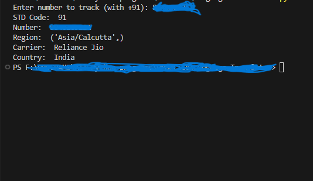

# Phone Number Tracker

<p align="justify">✍This Python script provides a simple CLI (Command Line Interface) tool to track phone numbers and retrieve associated metadata using the `phonenumbers` library. </p>

## Features

- Parse any given phone number to identify the carrier, region, and country.
- Automatically prepend the Indian country code (+91) if not provided.

## Requirements

- Python 3.x
- `phonenumbers` Python package

## Installation

Before running the script, ensure that the `phonenumbers` library is installed. You can install it via pip:

```bash
pip install phonenumbers
```

## Output
- #### showing the data
- 